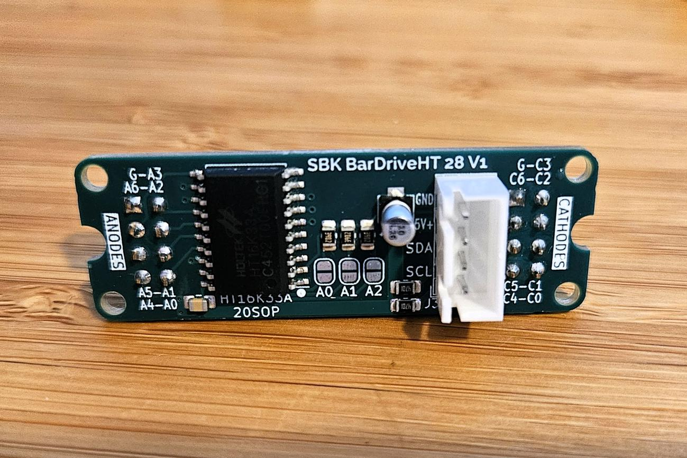

# SBK BarDriveHT 28

**HT16K33A-based I²C LED driver backpack for the SBK BarMeter SA28/SK28.**

The SBK BarDriveHT 28 V1 mounts behind a compatible [SBK BarMeter Sx28](../SBK%20BarMeter%20Sx28/) display board to create a compact, microcontroller-controlled LED bargraph. It provides the display driver, power connections, and I²C interface for projects such as animated props, dashboards, level indicators, and meters.

## Features

- **HT16K33A driver in a 20-pin SOP package**, controlled over I²C.
- **5 V power input**, with onboard 10 µF and 0.1 µF decoupling capacitors.
- **16 brightness levels** and hardware blinking supported by the driver.
- **Two 2×4 headers at 2.54 mm pitch** for the display's anode and cathode connections.
- **JST-XH 1×5 input connector footprint** for power and communication.
- **Compact backpack layout** with mounting holes and downloadable 3D models for mechanical integration.

## Display compatibility

This board is designed as a backpack for the **SBK BarMeter SA28 and SK28** PCBs. Other LED displays require compatible anode/cathode wiring and a matching software segment map.

*Example assembly with an SBK BarMeter SK28 V1. The display board is a separate component; check the selected product listing for included parts.*

## Connections

Use the PCB silkscreen and the [V1 specification drawing](docs/SBK_BarDriveHT_28_V1_spec_r0.pdf) to identify connector orientation before wiring.

| Input signal | Connection |
| --- | --- |
| `5V+` | Regulated 5 V supply |
| `GND` | Supply ground and microcontroller ground |
| `SDA` | I²C data |
| `SCL` | I²C clock |

The schematic shows **4.7 kΩ pull-up resistors from SDA and SCL to +5 V**. When using a microcontroller whose I²C pins are not 5 V tolerant, use suitable bidirectional I²C level translation.

The display connectors are **J1 (ANODES)** and **J2 (CATHODES)**. The schematic routes `ROW_0` through `ROW_6` to J1 and `COM_0` through `COM_6` to J2, with a ground connection on each header. Match the anode and cathode headers when stacking the boards.

### I²C address configuration

The PCB includes solder jumpers marked **A0, A1, and A2**. Consult the board schematic together with the package-specific information in the [HT16K33A datasheet](docs/HT16K33Av102.pdf) before changing them. Confirm the actual address with an I²C scanner; jumper-to-address behavior should be checked for the fitted IC rather than assumed from another HT16K33 board.

## Getting started

1. Fit the compatible BarMeter display board, checking header alignment and orientation with power disconnected.
2. Connect ground, regulated 5 V, SDA, and SCL as described above.
3. Run an I²C scanner from the host microcontroller to identify the driver.
4. Use an HT16K33-compatible driver implementation to enable the oscillator, clear display RAM, set brightness, and enable the display.
5. Apply the segment mapping for your SA28 or SK28 display and test individual segments before building animations.

This folder contains hardware documentation and mechanical models. Firmware examples and a verified display segment map are not included here. See the datasheet for display RAM organization and command details.

## Files

| File or folder | Contents |
| --- | --- |
| [V1 specification drawing](docs/SBK_BarDriveHT_28_V1_spec_r0.pdf) | Schematic, component list, board dimensions, and board views; revision 0 |
| [HT16K33A datasheet](docs/HT16K33Av102.pdf) | Driver electrical specifications, pin assignments, display RAM, and I²C commands; version 1.02 |
| [Driver board STEP model](models/SBK_BarDriveHT_28_V1.step) | 3D model of the BarDriveHT 28 V1 board |
| [Combined assembly STEP model](models/SBK_BarDriveHT_28_BarMeter_assembly_V1.step) | Driver and BarMeter assembly for CAD integration |
| [Combined assembly STL model](models/SBK_BarDriveHT_28_BarMeter_assembly_V1.stl) | Mesh representation of the combined assembly |
| [Images](Images/) | Board photographs, assembly photographs, and renders |

Use the STEP models and dimensioned drawing to check mounting positions and enclosure clearances. Native PCB design files and Gerber fabrication files are not included in this folder.

## Availability and support

SBK BarDriveHT 28 boards are available on demand, per unit or in small batches, either individually or bundled with a compatible SBK BarMeter PCB. For availability, pricing, assembly options, or custom quantities, please contact:

**[SmartBuildsKits@gmail.com](mailto:SmartBuildsKits@gmail.com)**

Boards are intended for hobbyists, educators, prototypes, and small-scale projects. Availability depends on component stock and production capacity.

## License

As described in the repository's [main README](../README.md), the shared schematic diagrams and mechanical board outlines are licensed under **Creative Commons Attribution-NonCommercial 4.0 International (CC BY-NC 4.0)**. See the repository [LICENSE](../LICENSE) for the terms and link to the full license.

The included Holtek datasheet remains subject to its publisher's terms.
