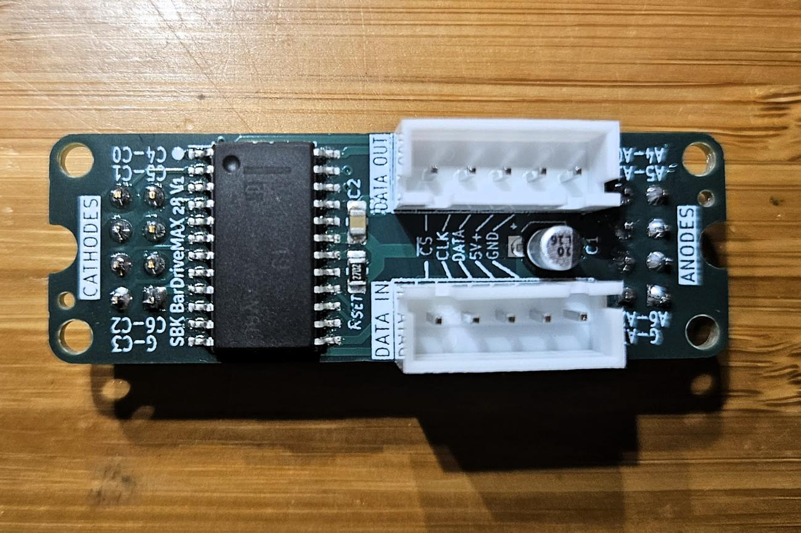
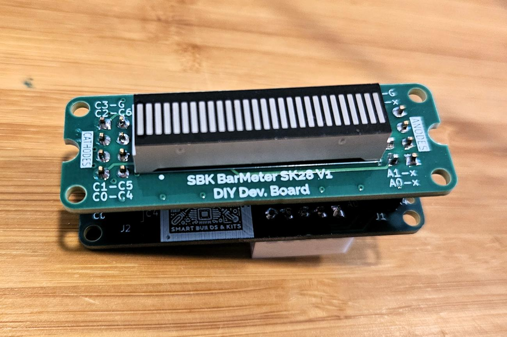

# SBK BarDriveMAX 28

**MAX7219/MAX7221-based serial LED driver backpack for the SBK BarMeter SA28/SK28.**

The SBK BarDriveMAX 28 V1 mounts behind a compatible [SBK BarMeter Sx28](../SBK%20BarMeter%20Sx28/) display board. It combines a 5 V LED driver, display connectors, and serial input/output connections for animated bargraphs, props, dashboards, and meters.

## Features

- **MAX7219/MAX7221 driver footprint** in a 24-pin SOIC package; check the fitted IC on your board.
- **Serial control** through data, clock, and LOAD/CS signals.
- **Separate input and output connectors** for chaining multiple driver boards.
- **Software brightness control**, display RAM, and multiplex scanning provided by the driver.
- **5 V supply**, with 10 µF and 0.1 µF decoupling capacitors.
- **27 kΩ current-setting resistor** shown in the V1 schematic; use the datasheet when evaluating LED current.
- **Two 2×4 display connectors at 2.54 mm pitch** and a downloadable STEP model.

## Display compatibility

The board is designed for the **SBK BarMeter SA28 and SK28** PCBs. Match the anode and cathode connectors and use the software segment mapping for the selected display variant. Other displays require compatible wiring and electrical characteristics.

*Example assembly. The driver and display boards are separate components and can also be supplied as a bundle.*

## Connections

Use the silkscreen and [V1 specification drawing](docs/SBK_BarDriveMAX_28_V1_spec_r0.pdf) to identify connector orientation.

| Signal | Connection |
| --- | --- |
| `5V+` | Regulated 5 V supply |
| `GND` | Supply ground and microcontroller ground |
| `DIN` / input data | Serial data from the microcontroller, or the preceding driver's `DOUT` |
| `CLK` | Serial clock |
| `CS` / `LOAD` | Chip select or data-latch control, depending on the fitted IC |
| `DOUT` / output data | Serial data to the next driver in the chain |

For a chain, connect the first board's output connector to the next board's input, matching each signal. Clock and LOAD/CS are shared; data passes from `DOUT` to the next `DIN`. Size the power supply for the complete assembly.

The driver datasheet specifies a **3.5 V minimum logic-high input** under its stated 5 V supply conditions. Use suitable logic-level translation with a 3.3 V host rather than assuming its outputs meet that threshold.

## Getting started

1. With power disconnected, fit the compatible BarMeter board and check anode/cathode header alignment.
2. Connect regulated 5 V, ground, serial data, clock, and LOAD/CS.
3. Initialize a driver implementation for the fitted MAX7219 or MAX7221. Use **no-decode mode** for individual LED control, configure the scan limit for the display wiring, clear the display registers, and select an initial brightness.
4. Exit shutdown mode and test individual segments using the mapping for your SA28 or SK28 display.
5. Add further boards if needed and configure the software for the number of chained drivers.

Firmware and a verified segment-mapping example are not included in this folder. Refer to the board schematic and the driver datasheet when implementing control software.

## Files

| File or folder | Contents |
| --- | --- |
| [V1 specification drawing](docs/SBK_BarDriveMAX_28_V1_spec_r0.pdf) | Schematic, component list, dimensions, and board views; revision 0 |
| [MAX7219/MAX7221 datasheet](docs/MAX7219-MAX7221.pdf) | Electrical specifications, serial interface, registers, and current-setting guidance |
| [Driver STEP model](models/SBK_BarDriveMAX_28_V1.step) | Board model for CAD integration and clearance checks |
| [Images](Images/) | Board photos, assembly photos, and renders |
| [Assembly preview video](videos/assembly-preview.mp4) | Existing MP4 preview of the driver/display assembly |

Native PCB design files and Gerber fabrication files are not included in this folder.

## Availability and support

SBK BarDriveMAX 28 boards are available on demand, per unit or in small batches, either individually or bundled with a compatible SBK BarMeter PCB. For availability, pricing, assembly options, or custom quantities, please contact:

**[SmartBuildsKits@gmail.com](mailto:SmartBuildsKits@gmail.com)**

Boards are intended for hobbyists, educators, prototypes, and small-scale projects. Availability depends on component stock and production capacity.

## License

The shared schematic diagrams and mechanical board outlines are licensed under **Creative Commons Attribution-NonCommercial 4.0 International (CC BY-NC 4.0)**. See the repository [LICENSE](../LICENSE). Included manufacturer datasheets remain subject to their publishers' terms.
