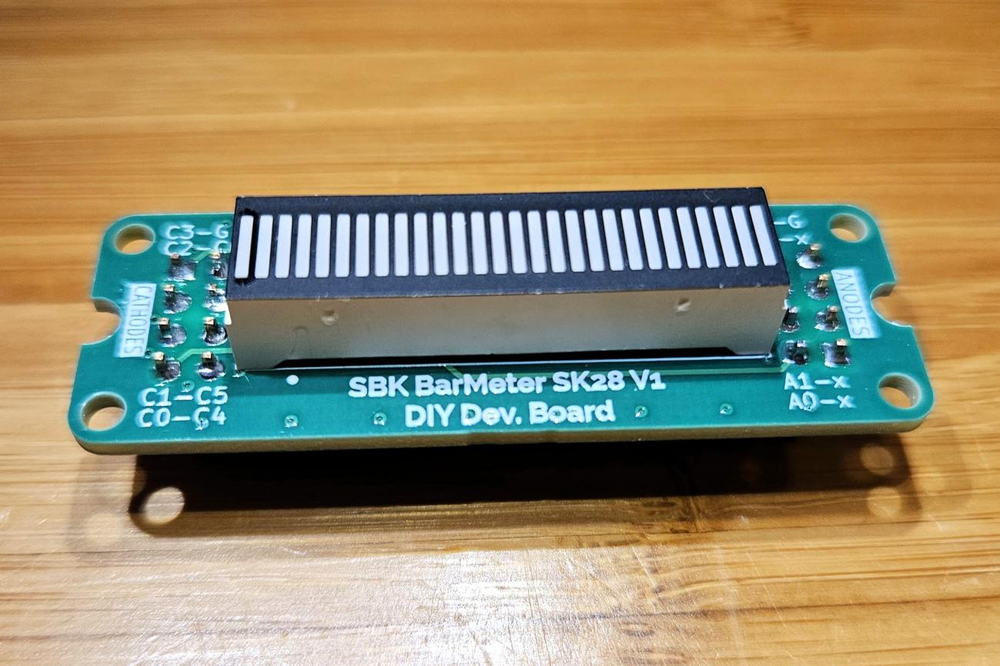
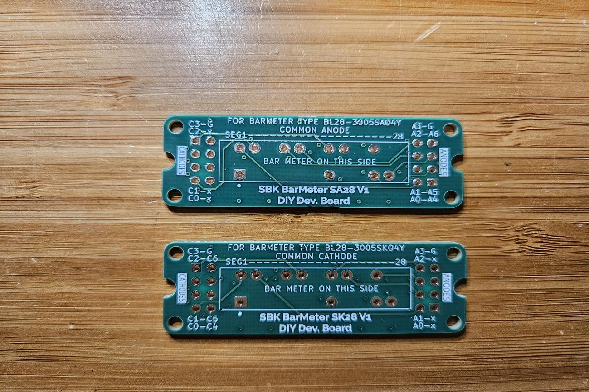
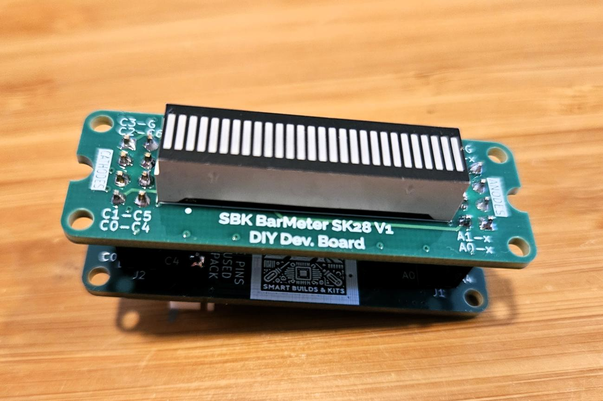

# SBK BarMeter Sx28

**28-segment LED bargraph PCBs in common-anode (SA28) and common-cathode (SK28) versions.**

The SBK BarMeter Sx28 family provides a mounting and connection board for compatible BL28-3005-series LED bargraph displays. Pair it with an SBK driver backpack to build a compact indicator for props, dashboards, meters, and other electronics projects.

## Choose the display variant

| Board | LED display listed in the V1 drawing | Polarity | Specification |
| --- | --- | --- | --- |
| **SA28 V1** | `BL28-3005SA04Y` | Common anode | [SA28 drawing](docs/SBK_BarMeter_SA28_V1_spec_r0.pdf) |
| **SK28 V1** | `BL28-3005SK04Y` | Common cathode | [SK28 drawing](docs/SBK_BarMeter_SK28_V1_spec_r0.pdf) |

Match the display's exact pinout and polarity to the board. SA28 and SK28 have different routing and require different software segment maps even when used with the same driver family.

## Features

- **28 LED segments** arranged as a linear bargraph.
- **Separate anode and cathode headers**, each 2×4 at 2.54 mm pitch.
- **Backpack mounting** with compatible SBK BarDriveHT 28 or BarDriveMAX 28 boards.
- **Direct-wiring option** for a suitable external LED driver.
- **Mounting holes and STEP models** for mechanical integration.

The BarMeter PCB carries the display and its connections; it does not include a serial LED driver. Supply and control requirements depend on the selected driver and LED display.

## Compatible driver backpacks

| Driver | Host interface | Documentation |
| --- | --- | --- |
| **SBK BarDriveHT 28** | I²C; HT16K33A-based | [Driver README](../SBK%20BarDriveHT%2028/) |
| **SBK BarDriveMAX 28** | Serial data, clock, and LOAD/CS; MAX7219/MAX7221-based | [Driver README](../SBK%20BarDriveMAX%2028/) |

*Example SK28 and BarDriveHT assembly. Display and driver boards can be supplied separately or as a compatible bundle.*

## Assembly and use

1. Select the SA28 or SK28 board to match the display's polarity and pinout.
2. Use the corresponding specification drawing to orient the display on the side marked **BAR METER ON THIS SIDE**.
3. Fit the display and headers, checking the **ANODES** and **CATHODES** labels. Follow the silkscreen guidance to keep protruding pins short when stacking boards.
4. With power disconnected, attach the compatible driver backpack or connect a suitable external driver according to the schematic.
5. Follow the driver's wiring and initialization instructions, then verify individual segments with the correct mapping for the selected display.

For direct wiring, use a suitable current-limited LED driving circuit. The display's anode/cathode headers are not a direct 5 V power input.

## Files

| File or folder | Contents |
| --- | --- |
| [SA28 V1 specification](docs/SBK_BarMeter_SA28_V1_spec_r0.pdf) | Common-anode schematic, component list, dimensions, and board views; revision 0 |
| [SK28 V1 specification](docs/SBK_BarMeter_SK28_V1_spec_r0.pdf) | Common-cathode schematic, component list, dimensions, and board views; revision 0 |
| [LED display datasheet](docs/BL28-3005sx04Y.pdf) | Display dimensions, pin definitions, polarity diagrams, and electrical characteristics |
| [SA28 STEP model](models/SBK_BarMeter_SA28_V1.step) | SA28 mechanical model |
| [SK28 STEP model](models/SBK_BarMeter_SK28_V1.step) | SK28 mechanical model |
| [Images](Images/) | Bare-board, assembled-board, and driver-bundle photographs |

Firmware, native PCB design files, and Gerber fabrication files are not included in this folder. The specification drawings are the reference for board wiring and dimensions.

## Availability and support

SBK BarMeter SA28/SK28 boards are available on demand, per unit or in small batches, either individually or bundled with a compatible SBK BarDriveHT 28 or BarDriveMAX 28 PCB. For availability, pricing, assembly options, or custom quantities, please contact:

**[SmartBuildsKits@gmail.com](mailto:SmartBuildsKits@gmail.com)**

Boards are intended for hobbyists, educators, prototypes, and small-scale projects. Availability depends on component stock and production capacity.

## License

The shared schematic diagrams and mechanical board outlines are licensed under **Creative Commons Attribution-NonCommercial 4.0 International (CC BY-NC 4.0)**. See the repository [LICENSE](../LICENSE). Included manufacturer datasheets remain subject to their publishers' terms.
